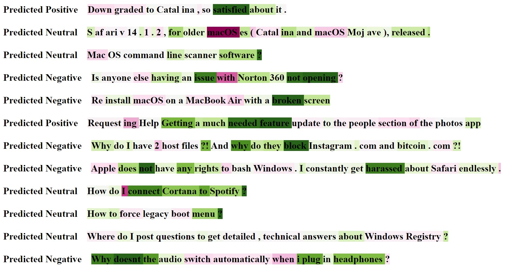
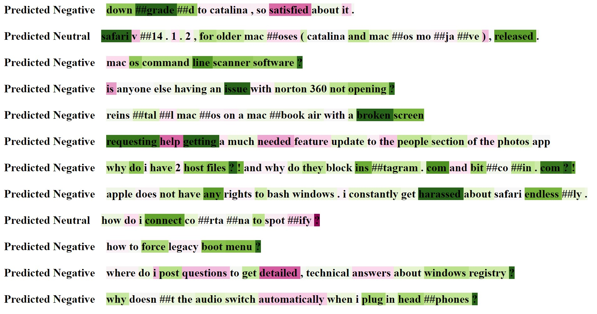

# Sentiment Analysis in Social Media 
This is a repository for NLP class 2022.

## DATASET
The data can be extracted using Reddit API, sourced from [Pushshift](https://files.pushshift.io/reddit/). Since the Pushshift API limits the number of 1000 data per request, it is necessary to apply multi-threaded downloads. PMAW (Pushshift Multithread API Wrapper) is a wrapper for the Pushshift API which uses multithreading to retrieve Reddit comments and submission

There are nearly 100k observations from January 2021 through the end of October 2022. Some data preprocessing methods are applied to the dataset for EDA,  including changing all words to lowercase, tokenization, removing stopwords, and lemmatization using the NLTK package.

## Introduction
The text evaluation would be gathered from two main subreddits: Windows and Mac OS. Three classes of "Positive," "Negative," and "Neutral" are taken into account in the sentiments. Using the pre-trained model of Twitter Roberta base sentiment and distilling BERT base trained on IMDB data, the sentiment would be identified with the score of three emotion classes, and with the application of integrated gradient, the sentiments of the word or sequence with the importance on the predicted sentiment would be determined. 

## Implementation and Results
The alibi implementation of the integrated gradients method is specific to TensorFlow and Keras models[8]. In this experiment, the embedding layer is involved in the gradient calculation as a baseline, which means we ensure that the attribution for tokens will be 0 if we use the embedding layer. The 0 attribution is due to integration between which is 0.

Predicted sentiments from RoBERTa-base model:

Predicted Sentiments from Distilling BERT base model:

Above two pictures shows the IG results for two models. The sentiment of the sentence has been predicted from RoBERTa base model and the Distilling Bert base model. The words highlighted in green show us which words led the model to positive sentiment while the red words contributed to negative sentiment, the importance of word get from the different shades of color. 
RoBERT base model is better than Distilling Bert base model because compared with movie reviews, the comments from social media are more similar to our data. In the meantime, the model performance is different too. Since we use the same model in tokenization as the training model, they do not have the same results in their tokens.
